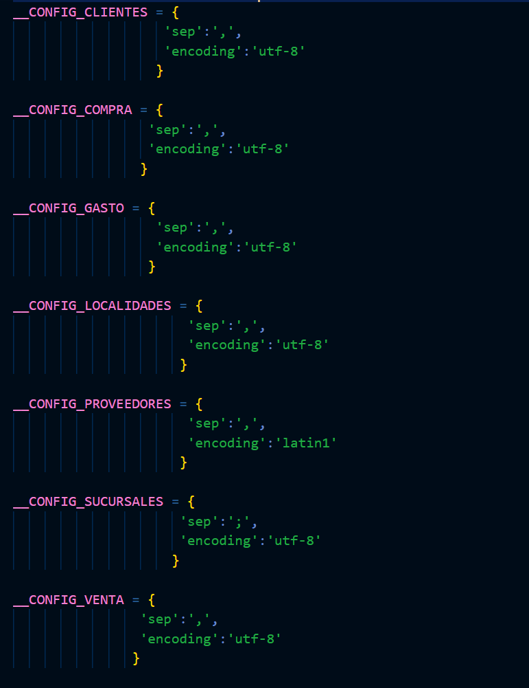
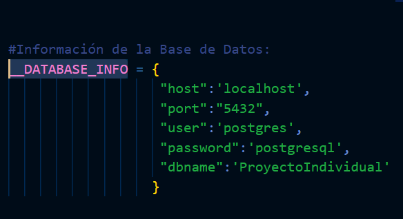

# **Notas de uso del script de automatización del PI**

#  **Notas de uso**:
- Guarde los datasets que quiere procesar en la carpeta 'Datasets'.
- Los datos que ya han sido procesados y cargados serán reubicados a la carpeta 'Datasets_cargados'.Tenga en cuenta que en caso de que ya existiera un dataset cargado con un mismo nombre, este será reemplazado con el nuevo dataset cargado.
- Para correr el script, debe abrir la consola de comandos, ubicarse en la carpeta del proyecto y ejecutar: 

      python __main__.py

---
---
# **Notas de configuración**:
## Para configurar el script, únicamente se debe modificar el archivo 'configuraciones.py'.  

>### Nota:  
    Tenga en cuenta que el motor de base de datos usada en este caso es PostgresQL.
---
---

## Variables que pueden ser modificadas:

1. Nombre del dato: **DATASETS**   
   Tipo de dato: **str**  
   >**Descripción:**  
   Nombre de la carpeta donde estarán alojados los datasets con los que se trabajaran.
               Esta carpeta **debe** estar ubicada en la misma carpeta donde se encuentra el scrip 
               de automatización. Note también que la cadena de texto debe terminar con '/'.

2. Nombre del dato: **DATASET_DESTINO**  
   Tipo de dato: **str**  
   >**Descripción:**  
   Nombre de la carpeta donde se reubicaran los datasets una vez cargados a las base de datos.
   Esta carpeta **debe** estar ubicada en la misma carpeta donde se encuentra el scrip de automatización. A diferencia de la anterior variable, esta **NO** debe terminar con slash.  

3. Configuración de los datasets  
   Tipo de datos: **dict**  
   >**Descripción:**  
   Aquí puede especificar el separador que traen los datasets
   modificando el valor de la key 'sep'.  
   También puede especificar el enconding modificando el valor de la key 'encoding'.

4. Nombre del dato: **__DATABASE_INFO**  
   Tipo de dato: **dict**  
   >**Descripción:**  
   Aquí puede especificar los datos que conciernen a la base de datos como el host, puerto, usuario, contraseña y nombre de la base de datos.  
   Únicamente cambie el valor de la key que desee cambiar.

    

## **Nota:**  
    Se recomienda no modificar nada más aparte de lo especificado arriba para evitar errores inesperados.

---